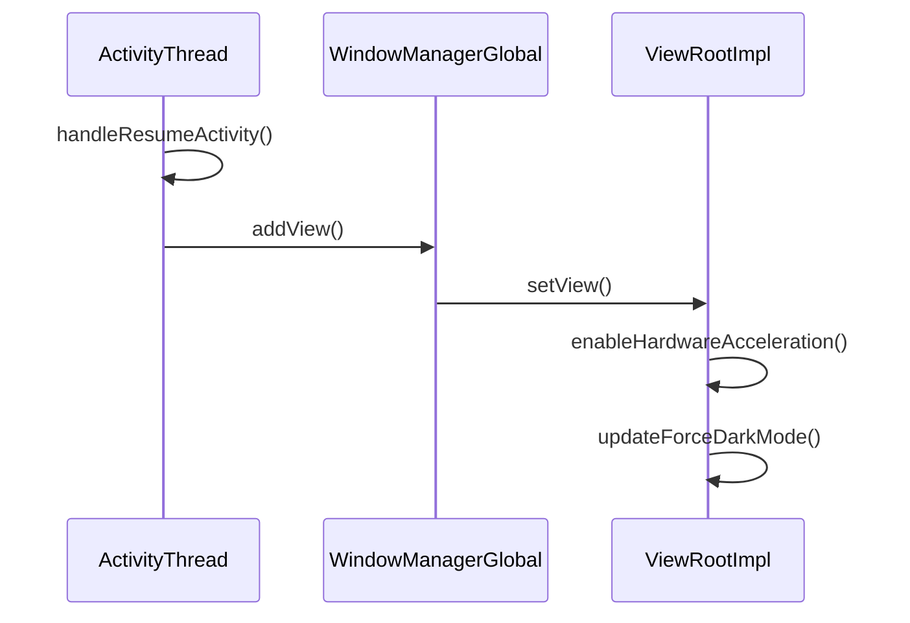
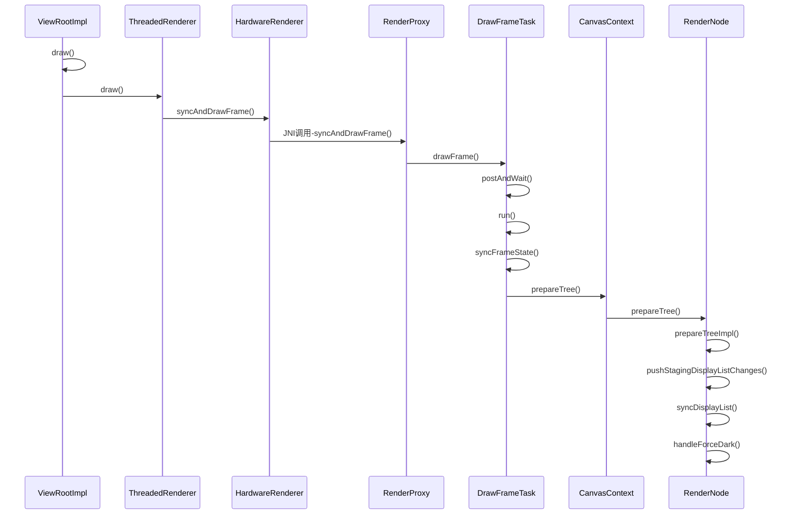

[toc]


# Android Dark Theme in Action (Android深色模式实战)

## 背景

从Android10（API 29）开始，在原有的主题适配的基础上，Google开始提供了Force Dark机制，在系统底层直接对颜色和图片进行转换处理，原生支持深色模式。到目前为止，我们从用户数据分析**50%**以上的用户已经使用上了Android10系统。深色模式可以节省电量、改善弱势及强光敏感用户的可视性，并能在环境亮度较暗的时候保护视力，更是夜间活跃用户的强烈需求。对深色模式的适配有利于提升用户口碑。

深色模式在安卓上可以分为以下四种场景：

* 强制深色模式
* 强制浅色模式
* 跟随系统

* 低电量自动切换深色

以下将介绍如何设置深色模式以及如何对深色模式进行适配。

## 资源配置限定符

我们常见的需要设置的资源有`drawable`、`layout`、`mipmap`和`values`等，对于这些资源，我们可以用一些限定符来表示提供一些备用资源，例如`drawable-xhdpi`表示超密度屏幕使用的资源，或者`layout-land`表示横向状态使用的布局。

同样的深色模式可以使用资源的限定符`-night`来表示在深色模式中使用的资源。如下图所示：


使用了`-night`限定符的文件夹里面的资源我们称为`night`资源，没有使用`-night`限定符的资源我们称为`notnight`资源。

其中`drawable-night-xhdpi`可以放置对应超密度屏幕使用的深色模式的图片，`values-night`可以声明对应深色模式使用的色值和主题。

所有的资源限定符定义以及添加的顺序（例如`-night`必须在`-xhdpi`之前）可查看[应用资源概览](https://developer.android.com/guide/topics/resources/providing-resources)中的[配置限定符名称表](https://developer.android.com/guide/topics/resources/providing-resources#QualifierRules)。

## 深色模式判断&设置

### 判断当前是否深色模式

[Configuration.uiMode ](https://developer.android.com/reference/android/content/res/Configuration#uiMode)有三种NIGHT的模式

* [UI_MODE_NIGHT_NO ](https://developer.android.com/reference/android/content/res/Configuration#UI_MODE_NIGHT_NO)表示当前使用的是`notnight`模式资源
* [UI_MODE_NIGHT_YES](https://developer.android.com/reference/android/content/res/Configuration#UI_MODE_NIGHT_YES) 表示当前使用的是`night`模式资源
* [UI_MODE_NIGHT_UNDEFINED](https://developer.android.com/reference/android/content/res/Configuration#UI_MODE_NIGHT_UNDEFINED) 表示当前没有设置模式

可以通过以下的代码来判断当前是否处于深色模式：

```kotlin
/**
 * 判断当前是否深色模式
 *
 * @return 深色模式返回 true，否则返回false
 */
fun isNightMode(): Boolean {
  return when (resources.configuration.uiMode and Configuration.UI_MODE_NIGHT_MASK) {
    Configuration.UI_MODE_NIGHT_YES -> true
    else -> false
  }
}
```

*Tips: 对于一些从网络接口服务获取的需要对深色模式区分的色值或者图片，可以使用上述的判断来获取对应的资源。*

### 判断当前深色模式场景

通过[AppCompatDelegate.getDefaultNightMode()](https://developer.android.com/reference/androidx/appcompat/app/AppCompatDelegate#getDefaultNightMode())可以获取五种深色模式场景：

* [MODE_NIGHT_AUTO_BATTERY](https://developer.android.com/reference/androidx/appcompat/app/AppCompatDelegate#MODE_NIGHT_AUTO_BATTERY) 低电量模式自动开启深色模式
* [MODE_NIGHT_FOLLOW_SYSTEM](https://developer.android.com/reference/androidx/appcompat/app/AppCompatDelegate#MODE_NIGHT_FOLLOW_SYSTEM) 跟随系统开启和关闭深色模式（默认）
* [MODE_NIGHT_NO](https://developer.android.com/reference/androidx/appcompat/app/AppCompatDelegate#MODE_NIGHT_NO) 强制使用`notnight`资源，表示非深色模式
* [MODE_NIGHT_YES](https://developer.android.com/reference/androidx/appcompat/app/AppCompatDelegate#MODE_NIGHT_YES) 强制使用`night`资源
* [MODE_NIGHT_UNSPECIFIED](https://developer.android.com/reference/androidx/appcompat/app/AppCompatDelegate#MODE_NIGHT_UNSPECIFIED) 配合 [setLocalNightMode(int)](https://developer.android.com/reference/androidx/appcompat/app/AppCompatDelegate#setLocalNightMode(int)) 使用，表示由Activity通过[AppCompactActivity.getDelegate()](https://developer.android.com/reference/kotlin/androidx/appcompat/app/AppCompatActivity#getdelegate)来单独设置页面的深色模式，不设置全局模式

### 模式设置

深色模式设置可以从三个层级设置，分别是系统层、Applcation层以及Activity层。底层的设置会覆盖上层的设置，例如系统设置了深色模式，但是Application设置了浅色模式，那么应用会显示浅色主题。


系统层是指系统设置中，根据不同产商的手机，可以在设置->显示中修改系统为深色模式。

Application层通过`AppCompatDelegate.setDefaultNightMode()`设置深色模式。

Activity层通过[getDelegate().setLocalNightMode()](https://developer.android.com/reference/androidx/appcompat/app/AppCompatDelegate.html#setLocalNightMode(int))设置深色模式。

当深色模式改变时，Activity会重建，如果不希望Activity重建，可以在`AndroidManifest.xml`中对对应的Activity设置`android:configChanges="uiMode"`，不过设置之后页面的颜色改变需要Activity在中通过监听`onConfigurationChanged`来动态改变。

通过[AppCompatDelegate.setDefaultNightMode(int)](https://developer.android.com/reference/androidx/appcompat/app/AppCompatDelegate#setDefaultNightMode(int))可以设置深色模式，源码如下：

```java
public static void setDefaultNightMode(@NightMode int mode) {
  if (DEBUG) {
    Log.d(TAG, String.format("setDefaultNightMode. New:%d, Current:%d",
                             mode, sDefaultNightMode));
  }
  switch (mode) {
    case MODE_NIGHT_NO:
    case MODE_NIGHT_YES:
    case MODE_NIGHT_FOLLOW_SYSTEM:
    case MODE_NIGHT_AUTO_TIME:
    case MODE_NIGHT_AUTO_BATTERY:
      if (sDefaultNightMode != mode) {
        sDefaultNightMode = mode;
        applyDayNightToActiveDelegates();
      }
      break;
    default:
      Log.d(TAG, "setDefaultNightMode() called with an unknown mode");
      break;
  }
}
```

从源码可以看出设置 [MODE_NIGHT_UNSPECIFIED](https://developer.android.com/reference/androidx/appcompat/app/AppCompatDelegate#MODE_NIGHT_UNSPECIFIED) 模式是不会生效的。

*Tips：注意，深色模式变化会导致Activity重建。*

## 适配方案

### 自定义适配

#### 1. 主题

将Application和Activity的主题修改为集成自`Theme.AppCompat.DayNight`或者`Theme.MaterialComponents.DayNight`，就可以对于大部分的控件得到较好的深色模式支持。我们看下DayNight主题的定义：


​	**res/values/values.xml**

```xml
<?xml version="1.0" encoding="utf-8"?>
<resources xmlns:ns1="urn:oasis:names:tc:xliff:document:1.2">		
    <!-- ... -->
    <style name="Theme.AppCompat.DayNight" parent="Theme.AppCompat.Light"/>
    <style name="Theme.AppCompat.DayNight.DarkActionBar" parent="Theme.AppCompat.Light.DarkActionBar"/>
    <style name="Theme.AppCompat.DayNight.Dialog" parent="Theme.AppCompat.Light.Dialog"/>
    <style name="Theme.AppCompat.DayNight.Dialog.Alert" parent="Theme.AppCompat.Light.Dialog.Alert"/>
    <style name="Theme.AppCompat.DayNight.Dialog.MinWidth" parent="Theme.AppCompat.Light.Dialog.MinWidth"/>
    <style name="Theme.AppCompat.DayNight.DialogWhenLarge" parent="Theme.AppCompat.Light.DialogWhenLarge"/>
    <style name="Theme.AppCompat.DayNight.NoActionBar" parent="Theme.AppCompat.Light.NoActionBar"/>
    <!-- ... -->
</resources>
```

​	**res/values-night-v8/values-night-v8.xml**

```xml
<?xml version="1.0" encoding="utf-8"?>
<resources>
    <style name="Theme.AppCompat.DayNight" parent="Theme.AppCompat"/>
    <style name="Theme.AppCompat.DayNight.DarkActionBar" parent="Theme.AppCompat"/>
    <style name="Theme.AppCompat.DayNight.Dialog" parent="Theme.AppCompat.Dialog"/>
    <style name="Theme.AppCompat.DayNight.Dialog.Alert" parent="Theme.AppCompat.Dialog.Alert"/>
    <style name="Theme.AppCompat.DayNight.Dialog.MinWidth" parent="Theme.AppCompat.Dialog.MinWidth"/>
    <style name="Theme.AppCompat.DayNight.DialogWhenLarge" parent="Theme.AppCompat.DialogWhenLarge"/>
    <style name="Theme.AppCompat.DayNight.NoActionBar" parent="Theme.AppCompat.NoActionBar"/>
    <style name="ThemeOverlay.AppCompat.DayNight" parent="ThemeOverlay.AppCompat.Dark"/>
</resources>
```


​	**res/values/values.xml**

```xml
<?xml version="1.0" encoding="utf-8"?>
<resources xmlns:ns1="urn:oasis:names:tc:xliff:document:1.2" xmlns:ns2="http://schemas.android.com/tools">
    <!-- ... -->
    <style name="Theme.MaterialComponents.DayNight" parent="Theme.MaterialComponents.Light"/>
    <style name="Theme.MaterialComponents.DayNight.BottomSheetDialog" parent="Theme.MaterialComponents.Light.BottomSheetDialog"/>
    <style name="Theme.MaterialComponents.DayNight.Bridge" parent="Theme.MaterialComponents.Light.Bridge"/>
    <style name="Theme.MaterialComponents.DayNight.DarkActionBar" parent="Theme.MaterialComponents.Light.DarkActionBar"/>
    <style name="Theme.MaterialComponents.DayNight.DarkActionBar.Bridge" parent="Theme.MaterialComponents.Light.DarkActionBar.Bridge"/>
    <style name="Theme.MaterialComponents.DayNight.Dialog" parent="Theme.MaterialComponents.Light.Dialog"/>
    <style name="Theme.MaterialComponents.DayNight.Dialog.Alert" parent="Theme.MaterialComponents.Light.Dialog.Alert"/>
    <style name="Theme.MaterialComponents.DayNight.Dialog.Alert.Bridge" parent="Theme.MaterialComponents.Light.Dialog.Alert.Bridge"/>
    <style name="Theme.MaterialComponents.DayNight.Dialog.Bridge" parent="Theme.MaterialComponents.Light.Dialog.Bridge"/>
    <style name="Theme.MaterialComponents.DayNight.Dialog.FixedSize" parent="Theme.MaterialComponents.Light.Dialog.FixedSize"/>
    <style name="Theme.MaterialComponents.DayNight.Dialog.FixedSize.Bridge" parent="Theme.MaterialComponents.Light.Dialog.FixedSize.Bridge"/>
    <style name="Theme.MaterialComponents.DayNight.Dialog.MinWidth" parent="Theme.MaterialComponents.Light.Dialog.MinWidth"/>
    <style name="Theme.MaterialComponents.DayNight.Dialog.MinWidth.Bridge" parent="Theme.MaterialComponents.Light.Dialog.MinWidth.Bridge"/>
    <style name="Theme.MaterialComponents.DayNight.DialogWhenLarge" parent="Theme.MaterialComponents.Light.DialogWhenLarge"/>
    <style name="Theme.MaterialComponents.DayNight.NoActionBar" parent="Theme.MaterialComponents.Light.NoActionBar"/>
    <style name="Theme.MaterialComponents.DayNight.NoActionBar.Bridge" parent="Theme.MaterialComponents.Light.NoActionBar.Bridge"/>
    <!-- ... -->
</resources>
```

​	**res/values-night-v8/values-night-v8.xml**

```xml
<?xml version="1.0" encoding="utf-8"?>
<resources>
    <style name="Theme.MaterialComponents.DayNight" parent="Theme.MaterialComponents"/>
    <style name="Theme.MaterialComponents.DayNight.BottomSheetDialog" parent="Theme.MaterialComponents.BottomSheetDialog"/>
    <style name="Theme.MaterialComponents.DayNight.Bridge" parent="Theme.MaterialComponents.Bridge"/>
    <style name="Theme.MaterialComponents.DayNight.DarkActionBar" parent="Theme.MaterialComponents"/>
    <style name="Theme.MaterialComponents.DayNight.DarkActionBar.Bridge" parent="Theme.MaterialComponents.Bridge"/>
    <style name="Theme.MaterialComponents.DayNight.Dialog" parent="Theme.MaterialComponents.Dialog"/>
    <style name="Theme.MaterialComponents.DayNight.Dialog.Alert" parent="Theme.MaterialComponents.Dialog.Alert"/>
    <style name="Theme.MaterialComponents.DayNight.Dialog.Alert.Bridge" parent="Theme.MaterialComponents.Dialog.Alert.Bridge"/>
    <style name="Theme.MaterialComponents.DayNight.Dialog.Bridge" parent="Theme.MaterialComponents.Dialog.Bridge"/>
    <style name="Theme.MaterialComponents.DayNight.Dialog.FixedSize" parent="Theme.MaterialComponents.Dialog.FixedSize"/>
    <style name="Theme.MaterialComponents.DayNight.Dialog.FixedSize.Bridge" parent="Theme.MaterialComponents.Dialog.FixedSize.Bridge"/>
    <style name="Theme.MaterialComponents.DayNight.Dialog.MinWidth" parent="Theme.MaterialComponents.Dialog.MinWidth"/>
    <style name="Theme.MaterialComponents.DayNight.Dialog.MinWidth.Bridge" parent="Theme.MaterialComponents.Dialog.MinWidth.Bridge"/>
    <style name="Theme.MaterialComponents.DayNight.DialogWhenLarge" parent="Theme.MaterialComponents.DialogWhenLarge"/>
    <style name="Theme.MaterialComponents.DayNight.NoActionBar" parent="Theme.MaterialComponents.NoActionBar"/>
    <style name="Theme.MaterialComponents.DayNight.NoActionBar.Bridge" parent="Theme.MaterialComponents.NoActionBar.Bridge"/>
    <style name="ThemeOverlay.MaterialComponents.DayNight.BottomSheetDialog" parent="ThemeOverlay.MaterialComponents.BottomSheetDialog"/>
    <style name="Widget.MaterialComponents.ActionBar.PrimarySurface" parent="Widget.MaterialComponents.ActionBar.Surface"/>
    <style name="Widget.MaterialComponents.AppBarLayout.PrimarySurface" parent="Widget.MaterialComponents.AppBarLayout.Surface"/>
    <style name="Widget.MaterialComponents.BottomAppBar.PrimarySurface" parent="Widget.MaterialComponents.BottomAppBar"/>
    <style name="Widget.MaterialComponents.BottomNavigationView.PrimarySurface" parent="Widget.MaterialComponents.BottomNavigationView"/>
    <style name="Widget.MaterialComponents.TabLayout.PrimarySurface" parent="Widget.MaterialComponents.TabLayout"/>
    <style name="Widget.MaterialComponents.Toolbar.PrimarySurface" parent="Widget.MaterialComponents.Toolbar.Surface"/>
</resources>
```

*Tips: MaterialComponents.Bridge继承自AppCompat主题，并增加了Material Components的主题属性，如果项目之前是用的AppCompat，那么使用对应的Bridge主题可以快速切换到Material Design。*

从上面的分析可以看出，DayNight就是在values以及values-night中分别定义了浅色和深色的主题。如果我们的主题直接继承DayNight主题，那么就不需要重复地声明对应的`night`主题资源了。

如果我们想对深色模式主题添加自定义属性，那么我们可以不继承DayNight主题，并显示地声明主题对应的`night`资源，例如

​	**res/values/themes.xml**

```xml
<style name="Theme.MyApp" parent="Theme.MaterialComponents.Light">
    <!-- ... -->
    <item name="android:windowLightStatusBar">true</item>
</style>
```

​	**res/values-night/themes.xml**

```xml
<style name="Theme.MyApp" parent="Theme.MaterialComponents">
    <!-- ... -->
    <item name="android:windowLightStatusBar">false</item>
</style>
```

*Tips: 若需要动态修改主题要在调用inflate之前调用，否则不会生效。*

#### 2. 色值

##### 主题切换颜色

除了定义不同模式使用不同的主题，我们还可以对主题设置自定义的色值。在设置主题色值之前，我们先了解一下Android主题的颜色系统。


* colorPrimary：主要品牌颜色，一般用于ActionBar背景
* colorPrimaryDark：默认用于顶部状态栏和底部导航栏
* colorPrimaryVariant：主要品牌颜色的可选颜色
* colorSecondary：第二品牌颜色
* colorSecondaryVariant：第二品牌颜色的可选颜色
* colorPrimarySurface：对应Light主题指向colorPrimary，Dark主题指向colorSurface
* colorOn[Primary, Secondary, Surface ...]，在Primary等这些背景的上面内容的颜色，例如ActioBar上面的文字颜色
* colorAccent：默认设置给colorControlActivated，一般是主要品牌颜色的明亮版本补充
* colorControlNormal：图标和控制项的正常状态颜色
* colorControlActivated：图标和控制项的选中颜色（例如Checked或者Switcher）
* colorControlHighlight：点击高亮效果（ripple或者selector）
* colorButtonNormal：按钮默认状态颜色
* colorSurface：cards, sheets, menus等控件的背景颜色
* colorBackground：页面的背景颜色
* colorError：展示错误的颜色
* textColorPrimary：主要文字颜色
* textColorSecondary：可选文字颜色

*Tips: 当某个属性同时可以通过 `?attr/xxx` 或者` ?android:attr/xxx`获取时，最好使用` ?attr/xxx`，因为`?android:attr/xxx`是通过系统获取，而`?attr/xxx`是通过静态库类似于AppCompat 或者 Material Design Component引入的。使用非系统版本的属性可以提高平台通用性。*

如果需要自定义主题颜色，我们可以对颜色分别定义`notnight`和`night`两份，放在`values`以及`values-night`资源文件夹中，并在自定义主题时，传入给对应的颜色属性。例如：

​	**res/values/styles.xml**

```xml
<resources>
    <style name="DayNightAppTheme" parent="Theme.MaterialComponents.DayNight.NoActionBar.Bridge">
        <item name="colorPrimary">@color/color_bg_1</item>
        <item name="colorPrimaryDark">@color/color_bg_1</item>
        <item name="colorAccent">@color/color_main_1</item>
    </style>
</resources>
```

​	**res/values/colors.xml**

```xml
<?xml version="1.0" encoding="utf-8"?>
<resources>
    <color name="color_main_1">#4D71FF</color>
    <color name="color_bg_1">#FFFFFF</color>
    <color name="color_text_0">#101214</color>
    <color name="color_light">#E0A62E</color>
</resources>
```

​	**res/values-night/colors.xml**

```xml
<?xml version="1.0" encoding="utf-8"?>
<resources>
    <color name="color_main_1">#FF584D</color>
    <color name="color_bg_1">#0B0C0D</color>
    <color name="color_text_0">#F5F7FA</color>
    <color name="color_light">#626469</color>
</resources>
```

##### 控件切换颜色

同样的，我们可以在布局的XML文件中直接使用定义好的颜色值，例如

```xml
<TextView 
      android:id="@+id/auto_color_text"
      android:text="自定义变色文字"
      android:background="@drawable/bg_text"
      android:textColor="@color/color_text_0" />
```

```xml
<?xml version="1.0" encoding="utf-8"?>
<shape xmlns:android="http://schemas.android.com/apk/res/android"
    android:shape="rectangle">
    <stroke android:color="@color/color_text_0" android:width="2dp"/>
    <solid android:color="@color/color_bg_1" />
</shape>
```

这样这个文字就会在深色模式中展示为黑底白字，在非深色模式中展示为白底黑字。


##### 动态设置颜色

如果需要代码设置颜色，如果色值已经设置过`notnight`和`night`两份，那么直接设置颜色就可以得到深色模式变色效果。

```kotlin
auto_color_text.setTextColor(ContextCompat.getColor(this, R.color.color_text_0))
```

如果色值是从服务接口获取，那么可以使用上述深色模式的判断设置。

```kotlin
auto_color_text.setTextColor(if (isNightMode()) {
  Color.parseColor(darkColorFromNetwork)
} else {
  Color.parseColor(colorFromNetwork)
})
```

##### 透明度处理

我们可以将颜色设置到一个selector中，并将selector设置到drawable的shape color中，最后将这个drawable设置到background中。

  **src/main/res/color/color_main_1_alpha_20.xml**

```xml
<?xml version="1.0" encoding="utf-8"?>
<selector xmlns:android="http://schemas.android.com/apk/res/android">
    <item android:alpha="0.5" android:color="@color/color_main_1"/>
</selector
```

  **src/main/res/drawable/bg_text.xml**

```xml
<?xml version="1.0" encoding="utf-8"?>
<shape xmlns:android="http://schemas.android.com/apk/res/android"
    android:shape="rectangle">
    <solid android:color="@color/color_main_1_alpha_20" />
</shape>
```

对于Api 23及以上，我们也可以对在设置背景的颜色的同时，设置带alpha的selector color到backgroundTint属性上。

例如通过代码设置：

```kotlin
tv_1.setBackgroundColor(ContextCompat.getColor(this, R.color.color_main_1))
tv_1.backgroundTintList = ContextCompat.getColorStateList(this, R.color.color_main_1_alpha_20)
```

通过Xml设置：

```xml
<TextView
        android:id="@+id/tv_1"
        android:layout_width="wrap_content"
        android:layout_height="wrap_content"
        android:layout_marginBottom="50dp"
        android:background="@color/color_main_1"
        android:backgroundTint="@color/color_main_1_alpha_20"
        android:padding="20dp"
        android:text="@string/not_define_night_color"
        android:textColor="@color/color_text_0"
        app:layout_constraintBottom_toBottomOf="parent"
        app:layout_constraintEnd_toEndOf="parent"
        app:layout_constraintStart_toStartOf="parent" />
```

#### 3. 图片&动画

##### 普通图片&Gif图片

将图片分为明亮模式和深色模式两份，分别放置在`drawable-night-xxx`以及`drawable-xxx`文件夹中，并在view中直接使用即可，当深色模式切换时，会使用对应深色模式的资源。如下图所示：


```xml
<ImageView android:src="@drawable/round_fingerprint" />
```

##### Vector图片

在Vector资源定义时，通过指定画笔颜色来实现对深色模式的适配，例如：

```xml
<vector xmlns:android="http://schemas.android.com/apk/res/android"
    android:width="24dp"
    android:height="24dp"
    android:tint="@color/color_light"
    android:viewportWidth="24"
    android:viewportHeight="24">
    <path
        android:fillColor="@android:color/white"
        android:pathData="M6.29,14.29L9,17v4c0,0.55 0.45,1 1,1h4c0.55,0 1,-0.45 1,-1v-4l2.71,-2.71c0.19,-0.19 0.29,-0.44 0.29,-0.71L18,10c0,-0.55 -0.45,-1 -1,-1L7,9c-0.55,0 -1,0.45 -1,1v3.59c0,0.26 0.11,0.52 0.29,0.7zM12,2c0.55,0 1,0.45 1,1v1c0,0.55 -0.45,1 -1,1s-1,-0.45 -1,-1L11,3c0,-0.55 0.45,-1 1,-1zM4.21,5.17c0.39,-0.39 1.02,-0.39 1.42,0l0.71,0.71c0.39,0.39 0.39,1.02 0,1.41 -0.39,0.39 -1.02,0.39 -1.41,0l-0.72,-0.71c-0.39,-0.39 -0.39,-1.02 0,-1.41zM17.67,5.88l0.71,-0.71c0.39,-0.39 1.02,-0.39 1.41,0 0.39,0.39 0.39,1.02 0,1.41l-0.71,0.71c-0.39,0.39 -1.02,0.39 -1.41,0 -0.39,-0.39 -0.39,-1.02 0,-1.41z" />
</vector>
```

其中`android:tint`为叠加颜色，`@color/color_light`已经分别定义好了`notnight`和`night`的色值。

##### Lottie

对于[Lottie](http://airbnb.io/lottie/#/README)动画，我们可以使用Lottie的[Dynamic Properties](http://airbnb.io/lottie/#/android?id=dynamic-properties)特性来针对深色模式进行颜色变化。例如我们有以下两个动画，左边是由颜色填充的机器人，右边是由描边生成的正在播放动画，我们可以调用`LottieAnimationView.resolveKeyPath()`方法获取动画的路径。


```kotlin
lottie_android_animate.addLottieOnCompositionLoadedListener {
  lottie_android_animate.resolveKeyPath(KeyPath("**")).forEach {
    Log.d(TAG, it.keysToString())
  }
  setupValueCallbacks()
}
```

对于机器小人打印的KeyPath如下：

```
2020-09-10 15:30:55.762 29281-29281/com.shengj.androiddarkthemedemo D/DarkThemeDemo: [MasterController]
2020-09-10 15:30:55.762 29281-29281/com.shengj.androiddarkthemedemo D/DarkThemeDemo: [Head]
2020-09-10 15:30:55.762 29281-29281/com.shengj.androiddarkthemedemo D/DarkThemeDemo: [Head, Group 3]
2020-09-10 15:30:55.762 29281-29281/com.shengj.androiddarkthemedemo D/DarkThemeDemo: [Head, Group 3, Fill 1]
2020-09-10 15:30:55.762 29281-29281/com.shengj.androiddarkthemedemo D/DarkThemeDemo: [Blink]
2020-09-10 15:30:55.762 29281-29281/com.shengj.androiddarkthemedemo D/DarkThemeDemo: [Blink, Rectangle 2]
2020-09-10 15:30:55.762 29281-29281/com.shengj.androiddarkthemedemo D/DarkThemeDemo: [Blink, Rectangle 2, Rectangle Path 1]
2020-09-10 15:30:55.762 29281-29281/com.shengj.androiddarkthemedemo D/DarkThemeDemo: [Blink, Rectangle 2, Fill 1]
2020-09-10 15:30:55.762 29281-29281/com.shengj.androiddarkthemedemo D/DarkThemeDemo: [Blink, Rectangle 1]
2020-09-10 15:30:55.762 29281-29281/com.shengj.androiddarkthemedemo D/DarkThemeDemo: [Blink, Rectangle 1, Rectangle Path 1]
2020-09-10 15:30:55.762 29281-29281/com.shengj.androiddarkthemedemo D/DarkThemeDemo: [Blink, Rectangle 1, Fill 1]
2020-09-10 15:30:55.762 29281-29281/com.shengj.androiddarkthemedemo D/DarkThemeDemo: [Eyes]
2020-09-10 15:30:55.762 29281-29281/com.shengj.androiddarkthemedemo D/DarkThemeDemo: [Eyes, Group 3]
2020-09-10 15:30:55.762 29281-29281/com.shengj.androiddarkthemedemo D/DarkThemeDemo: [Eyes, Group 3, Fill 1]
2020-09-10 15:30:55.762 29281-29281/com.shengj.androiddarkthemedemo D/DarkThemeDemo: [BeloOutlines]
2020-09-10 15:30:55.762 29281-29281/com.shengj.androiddarkthemedemo D/DarkThemeDemo: [BeloOutlines, Group 1]
2020-09-10 15:30:55.762 29281-29281/com.shengj.androiddarkthemedemo D/DarkThemeDemo: [BeloOutlines, Group 1, Stroke 1]
2020-09-10 15:30:55.762 29281-29281/com.shengj.androiddarkthemedemo D/DarkThemeDemo: [Shirt]
2020-09-10 15:30:55.762 29281-29281/com.shengj.androiddarkthemedemo D/DarkThemeDemo: [Shirt, Group 5]
2020-09-10 15:30:55.762 29281-29281/com.shengj.androiddarkthemedemo D/DarkThemeDemo: [Shirt, Group 5, Fill 1]
2020-09-10 15:30:55.762 29281-29281/com.shengj.androiddarkthemedemo D/DarkThemeDemo: [Body]
2020-09-10 15:30:55.762 29281-29281/com.shengj.androiddarkthemedemo D/DarkThemeDemo: [Body, Group 4]
2020-09-10 15:30:55.762 29281-29281/com.shengj.androiddarkthemedemo D/DarkThemeDemo: [Body, Group 4, Fill 1]
2020-09-10 15:30:55.762 29281-29281/com.shengj.androiddarkthemedemo D/DarkThemeDemo: [LeftFoot]
2020-09-10 15:30:55.762 29281-29281/com.shengj.androiddarkthemedemo D/DarkThemeDemo: [LeftFoot, Group 1]
2020-09-10 15:30:55.762 29281-29281/com.shengj.androiddarkthemedemo D/DarkThemeDemo: [LeftFoot, Group 1, Fill 1]
2020-09-10 15:30:55.762 29281-29281/com.shengj.androiddarkthemedemo D/DarkThemeDemo: [RightFoot]
2020-09-10 15:30:55.762 29281-29281/com.shengj.androiddarkthemedemo D/DarkThemeDemo: [RightFoot, Group 2]
2020-09-10 15:30:55.762 29281-29281/com.shengj.androiddarkthemedemo D/DarkThemeDemo: [RightFoot, Group 2, Fill 1]
2020-09-10 15:30:55.762 29281-29281/com.shengj.androiddarkthemedemo D/DarkThemeDemo: [LeftArmWave]
2020-09-10 15:30:55.762 29281-29281/com.shengj.androiddarkthemedemo D/DarkThemeDemo: [LeftArmWave, LeftArm]
2020-09-10 15:30:55.762 29281-29281/com.shengj.androiddarkthemedemo D/DarkThemeDemo: [LeftArmWave, LeftArm, Group 6]
2020-09-10 15:30:55.762 29281-29281/com.shengj.androiddarkthemedemo D/DarkThemeDemo: [LeftArmWave, LeftArm, Group 6, Fill 1]
2020-09-10 15:30:55.762 29281-29281/com.shengj.androiddarkthemedemo D/DarkThemeDemo: [LeftArmWave, LeftArm, Group 5]
2020-09-10 15:30:55.762 29281-29281/com.shengj.androiddarkthemedemo D/DarkThemeDemo: [LeftArmWave, LeftArm, Group 5, Fill 1]
2020-09-10 15:30:55.762 29281-29281/com.shengj.androiddarkthemedemo D/DarkThemeDemo: [RightArm]
2020-09-10 15:30:55.762 29281-29281/com.shengj.androiddarkthemedemo D/DarkThemeDemo: [RightArm, Group 6]
2020-09-10 15:30:55.762 29281-29281/com.shengj.androiddarkthemedemo D/DarkThemeDemo: [RightArm, Group 6, Fill 1]
2020-09-10 15:30:55.762 29281-29281/com.shengj.androiddarkthemedemo D/DarkThemeDemo: [RightArm, Group 5]
2020-09-10 15:30:55.762 29281-29281/com.shengj.androiddarkthemedemo D/DarkThemeDemo: [RightArm, Group 5, Fill 1]
```

我们抽取其中的某些形状来动态改变颜色，例如我们抽取左右手臂以及机器小人身上的T恤

```kotlin
private fun setupValueCallbacks() {
        // 机器人右手臂
        val rightArm = KeyPath("RightArm", "Group 6", "Fill 1")
        // 机器人左手臂
        val leftArm = KeyPath("LeftArmWave", "LeftArm", "Group 6", "Fill 1")
        // 机器人T恤
        val shirt = KeyPath("Shirt", "Group 5", "Fill 1")
        // 设置右手臂颜色
        lottie_android_animate.addValueCallback(rightArm, LottieProperty.COLOR) {
            ContextCompat.getColor(this, R.color.color_main_1)
        }
        // 设置左手臂颜色
        lottie_android_animate.addValueCallback(shirt, LottieProperty.COLOR) {
            ContextCompat.getColor(this, R.color.color_light)
        }
        // 设置T恤颜色
        lottie_android_animate.addValueCallback(leftArm, LottieProperty.COLOR) {
            ContextCompat.getColor(this, R.color.color_custom)
        }
  
        // 播放动画描边颜色
        lottie_playing_animate.addValueCallback(KeyPath("**"), LottieProperty.STROKE_COLOR) {
            ContextCompat.getColor(this, R.color.color_text_0)
        }
    }
```

由于`color_main_1`、`color_light`以及`color_custom`都已经定义过深色模式和明亮模式的色值，因此在深色模式切换时，Lottie动画的这个机器小人的左右手臂和T恤颜色会随着深色模式切换而变化。

同样的对于播放动画，我们也可以设置描边颜色，来达到深色模式切换的效果。

##### 网络获取图片

对于网络获取的图片，可以让服务接口分别给出明亮模式和深色模式两套素材，然后根据上述的深色模式判断来进行切换

```kotlin
Glide.with(this)
  .load(if(isNightMode() nightImageUrl else imageUrl))
  .into(imgView)
```

### Force Dark

看到这里可能会有人有疑问，对于大型的项目而言，里面已经hardcore了很多的颜色值，并且很多图片都没有设计成深色模式的，那做深色模式适配是不是一个不可能完成的任务呢？答案是否定的。对于大型项目而言，除了对所有的颜色和图片定义`night`资源的自定义适配方法外，我们还可以对使用`Light`风格主题的页面进行进行**强制深色模式转换**。

我们可以分别对主题和View设置强制深色模式。对于主题，在`Light`主题中设置`android:forceDarkAllowed`，例如：

```xml
<style name="LightAppTheme" parent="Theme.MaterialComponents.Light.NoActionBar.Bridge">
	<!-- ... -->
  <item name="android:forceDarkAllowed">true</item>
</style>
```

对于View，设置[View.setForceDarkAllowed(boolean)](https://developer.android.com/reference/android/view/View#setForceDarkAllowed(boolean))或者xml来设置是否支持Force Dark，默认值是true。

```xml
<View
  android:layout_width="wrap_content"
  android:layout_height="wrap_content"
  android:forceDarkAllowed="false"/>
```

这里需要注意的是，Force Dark的设置有以下几个规则：

1. 要强制深色模式生效必须开启硬件加速（默认开启）
2. 主题设置的Force Dark仅对`Light`的主题有效，对非`Light`的主题不管是设置`android:forceDarkAllowed`为`true`或者设置`View.setForceDarkAllowed(true)`都是无效的。
3. 父节点设置了不支持Force Dark，那么子节点再设置支持Force Dark无效。例如主题设置了`android:forceDarkAllowed`为`false`，则View设置`View.setForceDarkAllowed(true)`无效。同样的，如果View本身设置了支持Force Dark，但是其父layout设置了不支持，那么该View不会执行Force Dark
4. 子节点设置不支持Force Dark不受父节点设置支持Force Dark影响。例如View设置了支持Force Dark，但是其子Layout设置了不支持，那么子Layout也不会执行Force Dark。

*Tips：一个比较容易记的规则就是不支持Force Dark优先，View 的 Force Dark设置一般会设置成 false，用于排除某些已经适配了深色模式的 View。*
下面我们从源码出发来理解Force Dark的这些行为，以及看看系统是怎么实现Force Dark的。

*Tips：善用 https://cs.android.com/ 源码搜索网站可以方便查看系统源码。*

#### 1. 主题

从主题设置的`forceDarkAllowed`入手查找，可以找到

  **[frameworks/base/core/java/android/view/ViewRootImpl.java](https://cs.android.com/android/platform/superproject/+/master:frameworks/base/core/java/android/view/ViewRootImpl.java?q=forceDarkAllowed&ss=android%2Fplatform%2Fsuperproject)**

```java
private void updateForceDarkMode() {
  if (mAttachInfo.mThreadedRenderer == null) return;
  // 判断当前是否深色模式
  boolean useAutoDark = getNightMode() == Configuration.UI_MODE_NIGHT_YES;
  // 如果当前是深色模式
  if (useAutoDark) {
    // 获取Force Dark的系统默认值
    boolean forceDarkAllowedDefault =
      SystemProperties.getBoolean(ThreadedRenderer.DEBUG_FORCE_DARK, false);
    TypedArray a = mContext.obtainStyledAttributes(R.styleable.Theme);
    // 判断主题是否浅色主题 并且 判断主题设置的forceDarkAllowed
    useAutoDark = a.getBoolean(R.styleable.Theme_isLightTheme, true)
      && a.getBoolean(R.styleable.Theme_forceDarkAllowed, forceDarkAllowedDefault);
    a.recycle();
  }
  // 将是否强制使用深色模式赋值给Renderer层
  if (mAttachInfo.mThreadedRenderer.setForceDark(useAutoDark)) {
    // TODO: Don't require regenerating all display lists to apply this setting
    invalidateWorld(mView);
  }
}
```

而这个方法正式在`ViewRootImpl.enableHardwareAcceleration()`方法中调用的，因此可以得到第一个结论：**强制深色模式只在硬件加速下生效**。由于`userAutoDark`变量会判断当前主题是否为浅色，因此可以得到第二个结论：**强制深色模式只在浅色主题下生效**。直到这一步的调用链如下：



`mAttachInfo.mThreadedRenderer`为`ThreadRenderer`，继承自`HardwareRenderer`，指定了接下来的渲染操作由RanderThread执行。继续跟踪`setForceDark()`方法：

  **[frameworks/base/graphics/java/android/graphics/HardwareRenderer.java](https://cs.android.com/android/platform/superproject/+/master:frameworks/base/graphics/java/android/graphics/HardwareRenderer.java;drc=master;l=523)**

```java
public boolean setForceDark(boolean enable) {
  // 如果强制深色模式变化
  if (mForceDark != enable) {
    mForceDark = enable;
    // 调用native层设置强制深色模式逻辑
    nSetForceDark(mNativeProxy, enable);
    return true;
  }
  return false;
}

private static native void nSetForceDark(long nativeProxy, boolean enabled);
```

查找`nSetForceDark()`方法

  **[frameworks/base/libs/hwui/jni/android_graphics_HardwareRenderer.cpp](https://cs.android.com/android/platform/superproject/+/master:frameworks/base/libs/hwui/jni/android_graphics_HardwareRenderer.cpp?q=nSetForceDark&ss=android%2Fplatform%2Fsuperproject)**

```cpp
static const JNINativeMethod gMethods[] = {
		// ... 
    // 在Android Runtime启动时，通过JNI动态注册
    { "nSetForceDark", "(JZ)V", (void*)android_view_ThreadedRenderer_setForceDark },
    { "preload", "()V", (void*)android_view_ThreadedRenderer_preload },
};
```

查找`android_view_ThreadedRenderer_setForceDark()`方法

  **[frameworks/base/libs/hwui/jni/android_graphics_HardwareRenderer.cpp](https://cs.android.com/android/platform/superproject/+/master:frameworks/base/libs/hwui/jni/android_graphics_HardwareRenderer.cpp;l=586;bpv=1;bpt=1?q=android_view_ThreadedRenderer_setForceDark&sq=&ss=android%2Fplatform%2Fsuperproject)**

```cpp
static void android_view_ThreadedRenderer_setForceDark(JNIEnv* env, jobject clazz,
        jlong proxyPtr, jboolean enable) {
    RenderProxy* proxy = reinterpret_cast<RenderProxy*>(proxyPtr);
    // 调用RenderProxy的setForceDark方法
    proxy->setForceDark(enable);
}
```

  **[frameworks/base/libs/hwui/renderthread/RenderProxy.cpp](https://cs.android.com/android/platform/superproject/+/master:frameworks/base/libs/hwui/renderthread/RenderProxy.cpp;drc=master;bpv=1;bpt=1;l=308)**

```cpp
void RenderProxy::setForceDark(bool enable) {
		// 调用CanvasContext的setForceDark方法
    mRenderThread.queue().post([this, enable]() { mContext->setForceDark(enable); });
}
```

  **[frameworks/base/libs/hwui/renderthread/CanvasContext.h](https://cs.android.com/android/platform/superproject/+/master:frameworks/base/libs/hwui/renderthread/CanvasContext.h;drc=master;bpv=1;bpt=1;l=189)**

```cpp
// Force Dark的默认值是false
bool mUseForceDark = false;
// 设置mUseForceDark标志
void setForceDark(bool enable) { mUseForceDark = enable; }
bool useForceDark() {
  return mUseForceDark;
}
```

接着查找调用`userForceDark()`方法的地方

  **[frameworks/base/libs/hwui/TreeInfo.cpp](https://cs.android.com/android/platform/superproject/+/master:frameworks/base/libs/hwui/TreeInfo.cpp;l=27;drc=master;bpv=0;bpt=1)**

```cpp
TreeInfo::TreeInfo(TraversalMode mode, renderthread::CanvasContext& canvasContext)
        : mode(mode)
        , prepareTextures(mode == MODE_FULL)
        , canvasContext(canvasContext)
        // 设置disableForceDark变量
        , disableForceDark(canvasContext.useForceDark() ? 0 : 1)
        , screenSize(canvasContext.getNextFrameSize()) {}

}  // namespace android::uirenderer
```

e  **[frameworks/base/libs/hwui/TreeInfo.h](https://cs.android.com/android/platform/superproject/+/master:frameworks/base/libs/hwui/TreeInfo.h;drc=master;bpv=0;bpt=1;l=97)**

```cpp
class TreeInfo {
public:
    // ...
    int disableForceDark;
    // ...
};
```

到了这里，可以看出，当设置了Force Dark之后，最终会设置到`TreeInfo`类中的`disableForceDark`变量，如果没有设置主题的Force Dark，那么根据false的默认值，`disableForceDark`变量会别设置成1，如果设置了使用强制深色模式，那么`disableForceDark`会变成0。

这个变量最终会用在RenderNode的`RenderNode.handleForceDark()`过程中，到达的流程如下图：



  **[frameworks/base/libs/hwui/RenderNode.cpp](https://cs.android.com/android/platform/superproject/+/master:frameworks/base/libs/hwui/RenderNode.cpp;l=235;drc=master;bpv=0;bpt=1)**

```c++
void RenderNode::prepareTreeImpl(TreeObserver& observer, TreeInfo& info, bool functorsNeedLayer) {
    // ...
    // 同步正在处理的RenderNode Property变化
    if (info.mode == TreeInfo::MODE_FULL) {
        pushStagingPropertiesChanges(info);
    }
    // 如果当前View不允许被ForceDark，那么info.disableForceDark值+1
    if (!mProperties.getAllowForceDark()) {
        info.disableForceDark++;
    }
    // ...
    // 同步正在处理的Render Node的Display List，实现具体深色的逻辑
    if (info.mode == TreeInfo::MODE_FULL) {
        pushStagingDisplayListChanges(observer, info);
    }

    if (mDisplayList) {
        info.out.hasFunctors |= mDisplayList->hasFunctor();
        bool isDirty = mDisplayList->prepareListAndChildren(
                observer, info, childFunctorsNeedLayer,
                [](RenderNode* child, TreeObserver& observer, TreeInfo& info,
                   bool functorsNeedLayer) {
                    // 递归调用子节点的prepareTreeImpl。
                    // 递归调用之前，若父节点不允许强制深色模式，disableForceDark已经不为0，
                    //     子节点再设置允许强制深色模式不会使得disableForceDark的值减少，
                    //     因此有第三个规则：父节点设置了不允许深色模式，子节点再设置允许深色模式无效。
                    // 同样的，递归调用之前，若父节点允许深色模式，disableForceDark为0，
                    //     子节点再设置不允许强制深色模式，则disableForceDark值还是会++，不为0
                    //     因此有第四个规则：子节点设置不允许强制深色模式不受父节点设置允许强制深色模式影响。
                    child->prepareTreeImpl(observer, info, functorsNeedLayer);
                });
        if (isDirty) {
            damageSelf(info);
        }
    }
    pushLayerUpdate(info);
    // 递归结束后将之前设置过+1的值做回退-1恢复操作，避免影响其他兄弟结点的深色模式值判断
    if (!mProperties.getAllowForceDark()) {
        info.disableForceDark--;
    }
    info.damageAccumulator->popTransform();
}

void RenderNode::pushStagingDisplayListChanges(TreeObserver& observer, TreeInfo& info) {
    // ...
    // 同步DisplayList
    syncDisplayList(observer, &info);
    // ...
}

void RenderNode::syncDisplayList(TreeObserver& observer, TreeInfo* info) {
    // ...
    if (mDisplayList) {
        WebViewSyncData syncData {
            // 设置WebViewSyncData的applyForceDark
            .applyForceDark = info && !info->disableForceDark
        };
        mDisplayList->syncContents(syncData);
        // 强制执行深色模式执行
        handleForceDark(info);
    }
}

void RenderNode::handleForceDark(android::uirenderer::TreeInfo *info) {
    if (CC_LIKELY(!info || info->disableForceDark)) {
        // 如果disableForceDark不为0，关闭强制深色模式，则直接返回
        return;
    }
    auto usage = usageHint();
    const auto& children = mDisplayList->mChildNodes;
    // 如果有文字表示是前景策略
    if (mDisplayList->hasText()) {
        usage = UsageHint::Foreground;
    }
    if (usage == UsageHint::Unknown) {
        // 如果子节点大于1或者第一个子节点不是背景，那么设置为背景策略
        if (children.size() > 1) {
            usage = UsageHint::Background;
        } else if (children.size() == 1 &&
                children.front().getRenderNode()->usageHint() !=
                        UsageHint::Background) {
            usage = UsageHint::Background;
        }
    }
    if (children.size() > 1) {
        // Crude overlap check
        SkRect drawn = SkRect::MakeEmpty();
        for (auto iter = children.rbegin(); iter != children.rend(); ++iter) {
            const auto& child = iter->getRenderNode();
            // We use stagingProperties here because we haven't yet sync'd the children
            SkRect bounds = SkRect::MakeXYWH(child->stagingProperties().getX(), child->stagingProperties().getY(),
                    child->stagingProperties().getWidth(), child->stagingProperties().getHeight());
            if (bounds.contains(drawn)) {
                // This contains everything drawn after it, so make it a background
                child->setUsageHint(UsageHint::Background);
            }
            drawn.join(bounds);
        }
    }
    // 根据前景还是背景策略对颜色进行提亮或者加深
    mDisplayList->mDisplayList.applyColorTransform(
            usage == UsageHint::Background ? ColorTransform::Dark : ColorTransform::Light);
}
```

*Tips：View的绘制会根据VSYNC信号，将UI线程的Display List树同步到Render线程的Display List树，并通过生产者消费者模式将layout信息放置到SurfaceFlinger中，并最后交给Haredware Composer进行合成绘制。具体View渲染逻辑见参考章节的15~19文章列表。* 

 **[frameworks/base/libs/hwui/RecordingCanvas.cpp](https://cs.android.com/android/platform/superproject/+/master:frameworks/base/libs/hwui/RecordingCanvas.cpp;l=800;drc=master)**

```cpp
void DisplayListData::applyColorTransform(ColorTransform transform) {
    // 使用transform作为参数执行color_transform_fns函数组
    this->map(color_transform_fns, transform);
}

template <typename Fn, typename... Args>
inline void DisplayListData::map(const Fn fns[], Args... args) const {
    auto end = fBytes.get() + fUsed;
    // 遍历需要绘制的元素op，并调用对应类型的colorTransformForOp函数
    for (const uint8_t* ptr = fBytes.get(); ptr < end;) {
        auto op = (const Op*)ptr;
        auto type = op->type;
        auto skip = op->skip;
        if (auto fn = fns[type]) {  // We replace no-op functions with nullptrs
            fn(op, args...);        // to avoid the overhead of a pointless call.
        }
        ptr += skip;
    }
}

typedef void (*color_transform_fn)(const void*, ColorTransform);

#define X(T) colorTransformForOp<T>(),
static const color_transform_fn color_transform_fns[] = {
  // 相当于 colorTransformForOp<Flush>()
  X(Flush)
  X(Save)
  X(Restore)
  X(SaveLayer)
  X(SaveBehind)
  X(Concat44)
  X(Concat)
  X(SetMatrix)
  X(Scale)
  X(Translate)
  X(ClipPath)
  X(ClipRect)
  X(ClipRRect)
  X(ClipRegion)
  X(DrawPaint)
  X(DrawBehind)
  X(DrawPath)
  X(DrawRect)
  X(DrawRegion)
  X(DrawOval)
  X(DrawArc)
  X(DrawRRect)
  X(DrawDRRect)
  X(DrawAnnotation)
  X(DrawDrawable)
  X(DrawPicture)
  X(DrawImage)
  X(DrawImageNine)
  X(DrawImageRect)
  X(DrawImageLattice)
  X(DrawTextBlob)
  X(DrawPatch)
  X(DrawPoints)
  X(DrawVertices)
  X(DrawAtlas)
  X(DrawShadowRec)
  X(DrawVectorDrawable)
  X(DrawWebView)
};
#undef X

struct DrawImage final : Op {
    static const auto kType = Type::DrawImage;
    DrawImage(sk_sp<const SkImage>&& image, SkScalar x, SkScalar y, const SkPaint* paint,
              BitmapPalette palette)
            : image(std::move(image)), x(x), y(y), palette(palette) {
        if (paint) {
            this->paint = *paint;
        }
    }
    sk_sp<const SkImage> image;
    SkScalar x, y;
    // 这里SK指代skia库对象
    SkPaint paint;
    BitmapPalette palette;
    void draw(SkCanvas* c, const SkMatrix&) const { c->drawImage(image.get(), x, y, &paint); }
};

template <class T>
constexpr color_transform_fn colorTransformForOp() {
    if
        // 如果类型T有paint变量，并且有palette变量
        constexpr(has_paint<T> && has_palette<T>) {
            // It's a bitmap(绘制Bitmap)
            // 例如对于一个DrawImage的OP，最终会调用到这里
            // opRaw对应DrawImage对象，transform为ColorTransform::Dark或者ColorTransform::Light
            return [](const void* opRaw, ColorTransform transform) {
                // TODO: We should be const. Or not. Or just use a different map
                // Unclear, but this is the quick fix
                const T* op = reinterpret_cast<const T*>(opRaw);
                transformPaint(transform, const_cast<SkPaint*>(&(op->paint)), op->palette);
            };
        }
    else if
        constexpr(has_paint<T>) {
            return [](const void* opRaw, ColorTransform transform) {
                // TODO: We should be const. Or not. Or just use a different map
                // Unclear, but this is the quick fix
                // 非Bitmap绘制
                const T* op = reinterpret_cast<const T*>(opRaw);
                transformPaint(transform, const_cast<SkPaint*>(&(op->paint)));
            };
        }
    else {
        return nullptr;
    }
}
```

   **[frameworks/base/libs/hwui/CanvasTransform.cpp](https://cs.android.com/android/platform/superproject/+/master:frameworks/base/libs/hwui/CanvasTransform.cpp;drc=master;bpv=1;bpt=1;l=132)**

这里进行具体的颜色转换逻辑，我们首先关注非Bitmap绘制的颜色转换

```cpp
// 非Bitmap绘制颜色模式转换
bool transformPaint(ColorTransform transform, SkPaint* paint) {
    applyColorTransform(transform, *paint);
    return true;
}

// 非Bitmap绘制颜色模式转换
static void applyColorTransform(ColorTransform transform, SkPaint& paint) {
    if (transform == ColorTransform::None) return;
    // 具体绘制颜色转换逻辑
    SkColor newColor = transformColor(transform, paint.getColor());
    // 将画笔颜色修改为转换后的颜色
    paint.setColor(newColor);

    // 有渐变色情况
    if (paint.getShader()) {
        SkShader::GradientInfo info;
        std::array<SkColor, 10> _colorStorage;
        std::array<SkScalar, _colorStorage.size()> _offsetStorage;
        info.fColorCount = _colorStorage.size();
        info.fColors = _colorStorage.data();
        info.fColorOffsets = _offsetStorage.data();
        SkShader::GradientType type = paint.getShader()->asAGradient(&info);

        if (info.fColorCount <= 10) {
            switch (type) {
                // 线性渐变并且渐变颜色少于等于10个的情况
                case SkShader::kLinear_GradientType:
                    for (int i = 0; i < info.fColorCount; i++) {
                        // 对渐变色颜色进行转换
                        info.fColors[i] = transformColor(transform, info.fColors[i]);
                    }
                    paint.setShader(SkGradientShader::MakeLinear(info.fPoint, info.fColors,
                                                                 info.fColorOffsets, info.fColorCount,
                                                                 info.fTileMode, info.fGradientFlags, nullptr));
                    break;
                default:break;
            }

        }
    }

    // 处理colorFilter
    if (paint.getColorFilter()) {
        SkBlendMode mode;
        SkColor color;
        // TODO: LRU this or something to avoid spamming new color mode filters
        if (paint.getColorFilter()->asAColorMode(&color, &mode)) {
            // 对colorFilter颜色进行转换
            color = transformColor(transform, color);
            paint.setColorFilter(SkColorFilters::Blend(color, mode));
        }
    }
}

static SkColor transformColor(ColorTransform transform, SkColor color) {
    switch (transform) {
        case ColorTransform::Light:
            return makeLight(color);
        case ColorTransform::Dark:
            return makeDark(color);
        default:
            return color;
    }
}

// 前景色变亮
static SkColor makeLight(SkColor color) {
    // 将sRGB色彩模式转换成Lab色彩模式
    Lab lab = sRGBToLab(color);
    // 对亮度L维度取反
    float invertedL = std::min(110 - lab.L, 100.0f);
    if (invertedL > lab.L) {
        // 若取反后亮度变亮，则替换原来亮度
        lab.L = invertedL;
        // 重新转换为sRGB模式
        return LabToSRGB(lab, SkColorGetA(color));
    } else {
        return color;
    }
}

// 后景色变暗
static SkColor makeDark(SkColor color) {
    // 将sRGB色彩模式转换成Lab色彩模式
    Lab lab = sRGBToLab(color);
    // 对亮度L维度取反
    float invertedL = std::min(110 - lab.L, 100.0f);
    if (invertedL < lab.L) {
        // 若取反后亮度变暗，则替换原来亮度
        lab.L = invertedL;
        // 重新转换为sRGB模式
        return LabToSRGB(lab, SkColorGetA(color));
    } else {
        return color;
    }
}
```

从代码中可以看出，深色模式应用之后，通过对sRGB色彩空间转换[Lab色彩空间](https://zh.wikipedia.org/wiki/Lab%E8%89%B2%E5%BD%A9%E7%A9%BA%E9%97%B4)，并对表示亮度的维度L进行取反，并判断取反后前景色是不是更亮，后景色是不是更暗，若是的话就替换为原来的L，并再重新转换为sRGB色彩空间，从而实现反色的效果。

我们再来看对图片的强制深色模式处理：

```cpp
// Bitmap绘制颜色模式转换
bool transformPaint(ColorTransform transform, SkPaint* paint, BitmapPalette palette) {
    // 考虑加上filter之后图片的明暗
    palette = filterPalette(paint, palette);
    bool shouldInvert = false;
    if (palette == BitmapPalette::Light && transform == ColorTransform::Dark) {
        // 图片比较亮但是需要变暗
        shouldInvert = true;
    }
    if (palette == BitmapPalette::Dark && transform == ColorTransform::Light) {
        // 图片比较暗但是需要变亮
        shouldInvert = true;
    }
    if (shouldInvert) {
        SkHighContrastConfig config;
        // 设置skia反转亮度的filter
        config.fInvertStyle = SkHighContrastConfig::InvertStyle::kInvertLightness;
        paint->setColorFilter(SkHighContrastFilter::Make(config)->makeComposed(paint->refColorFilter()));
    }
    return shouldInvert;
}

// 获取paint filter的palette值，若没有filter直接返回原来的palette
static BitmapPalette filterPalette(const SkPaint* paint, BitmapPalette palette) {
    // 如果没有filter color返回原来的palette
    if (palette == BitmapPalette::Unknown || !paint || !paint->getColorFilter()) {
        return palette;
    }

    SkColor color = palette == BitmapPalette::Light ? SK_ColorWHITE : SK_ColorBLACK;
    // 获取filter color，并根据palette的明暗再叠加一层白色或者黑色
    color = paint->getColorFilter()->filterColor(color);
    // 根据将颜色转换为HSV空间，并返回是图片的亮度是亮还是暗
    return paletteForColorHSV(color);
}
```

从代码中可以看出，对于Bitmap类型的绘制，先判断原来绘制Bitmap的明暗度，如果原来绘制的图像较为明亮但是需要变暗，或者原来绘制的图像较为暗需要变明亮，则设置一个明亮度转换的filter到画笔paint中。

至此，对于主题级别的强制深色转换原理已经非常清晰。**总结一下，就是需要对前景色变亮和背景色变暗，然后对于非Bitmap类型明暗变化采用的是将色值转换为Lab颜色空间进行明亮度转换，对于Bitmap类型的明暗变化采取设置亮度转换的filter进行。**

#### 2. View

无论是设置View的xml的`android:forceDarkAllowed`属性，还是调用`View.setForceDarkAllowed()`最后还是调用到[frameworks/base/core/java/android/view/View.java](https://cs.android.com/android/platform/superproject/+/master:frameworks/base/core/java/android/view/View.java?q=setForceDarkAllowed)的`mRenderNode.setForceDarkAllowed()`方法。

   **[frameworks/base/graphics/java/android/graphics/RenderNode.java](https://cs.android.com/android/platform/superproject/+/master:frameworks/base/graphics/java/android/graphics/RenderNode.java;drc=master;l=1414)**

```java
public boolean setForceDarkAllowed(boolean allow) {
  return nSetAllowForceDark(mNativeRenderNode, allow);
}
```

`nSetAllowForceDark`通过JNI调用到`android_view_RenderNode_setAllowForceDark`Navtive方法中。

   **[frameworks/base/libs/hwui/jni/android_graphics_RenderNode.cpp](https://cs.android.com/android/platform/superproject/+/master:frameworks/base/libs/hwui/jni/android_graphics_RenderNode.cpp;l=744?q=nSetAllowForceDark&ss=android%2Fplatform%2Fsuperproject)**

```cpp
static const JNINativeMethod gMethods[] = {
  // ...
  { "nSetAllowForceDark",        "(JZ)Z", (void*) android_view_RenderNode_setAllowForceDark },
  // ...
};

static jboolean android_view_RenderNode_setAllowForceDark(CRITICAL_JNI_PARAMS_COMMA jlong renderNodePtr, jboolean allow) {
    return SET_AND_DIRTY(setAllowForceDark, allow, RenderNode::GENERIC);
}

#define SET_AND_DIRTY(prop, val, dirtyFlag) \
    (reinterpret_cast<RenderNode*>(renderNodePtr)->mutateStagingProperties().prop(val) \
        ? (reinterpret_cast<RenderNode*>(renderNodePtr)->setPropertyFieldsDirty(dirtyFlag), true) \
        : false)
```

最后这个是否允许深色模式的`allow`变量被设置到`RenderProperties.h` 中

  **[frameworks/base/libs/hwui/RenderProperties.h](https://cs.android.com/android/platform/superproject/+/master:frameworks/base/libs/hwui/RenderProperties.h;l=553;drc=master)**

```cpp
/*
 * Data structure that holds the properties for a RenderNode
 */
class ANDROID_API RenderProperties {
public:
    // ...
    // 设置View是否允许强制深色模式
    bool setAllowForceDark(bool allow) {
        return RP_SET(mPrimitiveFields.mAllowForceDark, allow);
    }
    // 获取View是否允许强制深色模式
    bool getAllowForceDark() const {
        return mPrimitiveFields.mAllowForceDark;
    }
    // ...
private:
    // Rendering properties
    struct PrimitiveFields {
        // ...
        // 默认值为true
        bool mAllowForceDark = true;
        // ...
    } mPrimitiveFields;
```

我们回头看下上面分析过的`RenderNode.cpp`的`prepareTreeImpl`流程

  **[frameworks/base/libs/hwui/RenderNode.cpp](https://cs.android.com/android/platform/superproject/+/master:frameworks/base/libs/hwui/RenderNode.cpp;l=235;drc=master;bpv=0;bpt=1)**

```cpp
// 经过了简化处理的prepareTreeImpl逻辑
void RenderNode::prepareTreeImpl(TreeObserver& observer, TreeInfo& info) {
    // 如果当前View不允许被ForceDark，那么info.disableForceDark值+1
    if (!mProperties.getAllowForceDark()) {
        info.disableForceDark++;
    }

    // 同步正在处理的Render Node的Display List，实现具体深色的逻辑
    pushStagingDisplayListChanges(observer, info);

    mDisplayList->prepareListAndChildren([](RenderNode* child, TreeObserver& observer, TreeInfo& info) {
        // 递归调用子节点的prepareTreeImpl。
        // 递归调用之前，若父节点不允许强制深色模式，disableForceDark已经不为0，
        //     子节点再设置允许强制深色模式不会使得disableForceDark的值减少，
        //     因此有第三个规则：父节点设置了不允许深色模式，子节点再设置允许深色模式无效。
        // 同样的，递归调用之前，若父节点允许深色模式，disableForceDark为0，
        //     子节点再设置不允许强制深色模式，则disableForceDark值还是会++，不为0
        //     因此有第四个规则：子节点设置不允许强制深色模式不受父节点设置允许强制深色模式影响。
        child->prepareTreeImpl(observer, info);
      });
    
    // 递归结束后将之前设置过+1的值做回退-1恢复操作，避免影响其他兄弟结点的深色模式值判断
    if (!mProperties.getAllowForceDark()) {
        info.disableForceDark--;
    }
}
```

可以看出，设置View的`forceDarkAllowed`最终会设置到当前`RenderNode`的`mProperties.allowForceDark`属性中，并在`RenderNode`遍历的过程中影响深色模式的执行。

我们可以以下面的伪代码来更直观地了解深色模式执行的流程：

```java
// 深色模式渲染伪代码
int disableDark = if (themeAllowDark) 0 else 1;

void RenderNode(Node node) {
  if (!node.allowDark) {
    disableDark++;
  }
  if (disableDark == 0) forceDarkCurrentNode();
  for (child : node.children) {
    RenderNode(child)
  }
  if (!node.allowDark) {
    disableDark--;
  }
}
```

至此，我们分析完所有强制深色模式的原理。**总结一下，主题默认不会强制深色，若主题设置了强制深色，则遍历View树对其节点进行强制深色转换。碰到某个View不希望被强制深色，则包括它和它的所有子节点都不会被强制深色。**


## 项目指导（词典项目）

查看项目指导之前，请先查阅上面的适配方案及原理介绍。


### 新功能模块

安卓词典9.0.4版本发布的功能需要合并**dev_dark_theme**分支再进行开发，9.0.4将发布深色模式功能。

由于自定适配和ForceDark适配分别在Android8和Andorid10中生效，混合使用的话可能会造成页面有一部分深色样式一部分浅色样式的问题。**为了避免不同版本混合使用这两种适配方式带来的问题，所有自定义适配的资源都应该放置在带`-v29`的资源文件中！**

> ***我们规定无论是自定义适配还是ForceDark适配，都应该只在Android10及以后的版本才能生效。***

#### 使用自定义适配模式

对于新项目和新模块，需要UI给出浅色和深色两套设计方案，并进行自定义适配。自定义适配需要遵循以下规则：

1. 主题**不能**声明forceDarkAllowed，或显示声明forceDarkAllowed为**false**
2. Xml的Layout和自定义View**必须**显示声明forceDarkAllowed为**fasle**
3. Style主题使用DayNight，推荐使用`Theme.MaterialComponents.DayNight.*`，对于需自定义深色模式的主题，放置在`values-night-v29`文件夹中
4. 自定义深色模式色值放到`values-night-v29`文件夹中，尽量使用已经在`lib_widget`模块中定义好深色模式的color_xxx色值
5. 自定义深色模式的图片资源放到`drawable-night-xhdpi-v29`等带`-night-***-v29`文件中。
6. 更多主题、色值、图片、动画等处理见【适配方案】->【自定义适配】

#### 混合使用ForceDark适配

**对于新项目和新模块，尽量避免使用ForceDark方式适配。**当且仅当项目紧急且UI来不及适配的情况下使用。如若使用ForceDark，需遵循下面规则：

1. 一旦页面主题使用了ForceDark，则在ForceDark生效的页面对某些View的颜色或者图标进行微调的，需要将资源放置到带`-night-v29`后缀的文件中。

2. 对需要ForceDark的主题显示声明forceDarkAllowed为**true**，需要对主题微调的话复制一份放到`values-night-v29`文件夹中进行修改。

3. 需要对某个View微调的话，需要显示声明forceDarkAllowed为**false**，并在对应`-v29`的资源文件夹中定义深色模式资源。需要注意的是，当对某个View设置forceDarkAllowed为false时，其所有孩子View节点都需要进行自定义适配，孩子声明forceDarkAllowed为true将不再生效。

   > ForceDark和`night`资源自定义适配会产生叠加的效果，如果某些组件已经使用了自定义资源，不希望被forcedark，那么需要单独设置`android:forceDarkAllowed="false"`


### 旧项目改造

如果需要对9.0.4之前已经发布的功能进行深色模式适配，需要采用混合ForceDark适配方法，具体步骤参考【项目指导】->【新功能模块】->【混合使用ForceDark适配】。

#### 词典已有功能深色模式改造遇到的坑

* 某些页面或者控件没有声明继承自Light的主题，或者手动设置了非Light的主题，在强制深色模式的时候会导致这些页面或者控件得不到强制深色模式转换。这时判断原本页面如果是浅色的话，将主题改成Light，并设置ForceDark。
* 某些页面直接在xml中写死了主题类型，并没有使用style.xml定义的主题，这种情况对于这些页面需要单独设置一下使用强制深色模式
* 启动的Starting Window需要使用自定义颜色，不能强制深色。因为Starting Window阶段App还不能接管。
* SDK中定义的主题需要替换的问题。若想不改SDK要不就在主工程复制一个改成forcedark，如果SDK中直接继承的是基础主题，可以在manifest中重新定义主题，并使用tools:replace="theme"
* 旧项目中有动态设置状态栏颜色的，在设置颜色的入口中需要进行深色模式判断，如果是深色模式即取反。
* Library库中的颜色和图片可在主工程中声明图样名字的进行覆盖。
* 使用Inflate绘制的时候注意使用的context需要是设置了深色模式主题的context。
* 对于自定义view中直接调用draw方法绘制到最顶层的元素，系统会认为是前景色不会进行深色变化，这个时候的绘制需使用自定义适配方案，并声明forcedark为false
* inflate没有attached root的然后直接draw画出来的需要设置layouttype为hardware并且手动调用invalid，因为没有attatched root并不会走到viewRoot的深色模式变化流程


### 最佳实践

* 尽量使用系统提供的Notification样式

* 避免hardcode颜色值

* 尽量使用Vector类型的Drawable并动态设置颜色

* 编写代码时刻考虑深色模式处理

* 尽量避免使用.9图片，若要使用需提供深色模式版本

* 圆角使用Glide的transform实现

  

### 其他处理

#### ReactNative

由于RN最后都会由原生控件进行渲染，因此可以对承载RN的页面主题设置ForceDark可以实现强制深色模式转换。

#### WebView深色模式处理

##### 自定义适配

我们可以通过设置UserAgent以及调用前端方法的方式来通知前端进行自定义深色适配，前提是前端已经实现了对应深色逻辑。

设置UserAgent（词典）：

```kotlin
private const val DARK_WEB_UA = " YDUIStyle/Dark"
webView.settings.userAgentString = webView.settings.userAgentString + DARK_WEB_UA
```

调用前端方法（词典）：

```kotlin
webView.evaluateJavascript("window.setYDUIStyle('dark')", null)
webView.evaluateJavascript("window.setYDUIStyle('light')", null)
```

##### Force Dark 

首先在gradle中声明webkit依赖：

```groovy
implementation "androidx.webkit:webkit:$webkitVersion"
```

然后通过`WebSettingsCompat`进行设置：

```java
// 判断Webview版本是否支持设置ForceDark
if (WebViewFeature.isFeatureSupported(WebViewFeature.FORCE_DARK)) {
  // 开启WebView ForceDark
  WebSettingsCompat.setForceDark(webView.settings, WebSettingsCompat.FORCE_DARK_ON)
  // 关闭WebView ForceDark
  WebSettingsCompat.setForceDark(webView.settings, WebSettingsCompat.FORCE_DARK_OFF)
}
```

#### Flutter 深色模式适配

待补充。


### 词典中深色模式工具

```kotlin
object NightModeUtil {
    private const val DARK_WEB_UA = " YDUIStyle/Dark"
    /**
     * 判断当前是否深色模式
     *
     * @return 深色模式返回 true，否则返回false
     */
    @JvmStatic
    fun isNightMode(context: Context): Boolean {
        if (!isNightModeAvailable()) return false
        return when (context.resources.configuration.uiMode and Configuration.UI_MODE_NIGHT_MASK) {
            Configuration.UI_MODE_NIGHT_YES -> true
            else -> false
        }
    }

    /**
     * 判断是否能设置深色模式
     *
     * @return 可以返回true，否则返回false
     */
    @JvmStatic
    fun isNightModeAvailable(): Boolean {
        return Build.VERSION.SDK_INT >= Build.VERSION_CODES.Q
    }

    /**
     * 根据深色模式设置webview ua
     */
    @JvmStatic
    fun changeWebViewNightModeUA(webView: WebView) {
        val ua = webView.settings.userAgentString
        if (isNightMode(webView.context)) {
            if (!ua.contains(DARK_WEB_UA)) {
                webView.settings.userAgentString = ua + DARK_WEB_UA
            }
        } else {
            if (ua.contains(DARK_WEB_UA)) {
                webView.settings.userAgentString = ua.replace(DARK_WEB_UA, "")
            }
        }
    }

    /**
     * 处理webview深色模式
     *
     * 由于网页会使用大量图片，ForceDark后效果一般，直接禁用ForceDark并通知前端进行自定义适配
     */
    @JvmStatic
    fun changeWebViewNightMode(webView: WebView) {
        if (WebViewFeature.isFeatureSupported(WebViewFeature.FORCE_DARK)) {
            WebSettingsCompat.setForceDark(webView.settings, WebSettingsCompat.FORCE_DARK_OFF)
        }
        if (isNightMode(webView.context)) {
            webView.evaluateJavascript("window.setYDUIStyle('dark')", null)
        } else {
            webView.evaluateJavascript("window.setYDUIStyle('light')", null)
        }
    }
}
```

```java
public class DictApplication extends Application {
  /**
   * 判断当前词典深色模式设置选项，并设置深色模式
   */
  public static void checkNightMode() {
        if (NightModeUtil.isNightModeAvailable()) {
            String type = PreferenceUtil.getString(PreferenceSetting.DARK_MODE_KEY, "auto");
            switch (type) {
                case "dark":
                    AppCompatDelegate.setDefaultNightMode(AppCompatDelegate.MODE_NIGHT_YES);
                    break;
                case "light":
                    AppCompatDelegate.setDefaultNightMode(AppCompatDelegate.MODE_NIGHT_NO);
                    break;
                default:
                    AppCompatDelegate.setDefaultNightMode(AppCompatDelegate.MODE_NIGHT_FOLLOW_SYSTEM);
            }
        }
    }
}
```

## Demo

上述提到的代码可以到这个[Github项目](https://github.com/shenguojun/AndroidDarkThemeDemo)下载

## 参考

1. [Google Developers - Dark Theme](https://developer.android.com/guide/topics/ui/look-and-feel/darktheme#top_of_page)
2. [Material Design - Dark Theme](https://material.io/develop/android/theming/dark)
3. [Material Design - The color system](https://material.io/design/color/the-color-system.html)
4. [Android 10 暗黑模式适配，你需要知道的一切](https://juejin.im/post/6844904173788463112#heading-15)
5. [Android 10 Dark Theme: Getting Started](https://www.raywenderlich.com/6488033-android-10-dark-theme-getting-started)
6. [Android styling: themes vs styles](https://medium.com/androiddevelopers/android-styling-themes-vs-styles-ebe05f917578)
7. [Android styling: common theme attributes](https://medium.com/androiddevelopers/android-styling-common-theme-attributes-8f7c50c9eaba)
8. [Android Styling: prefer theme attributes](https://medium.com/androiddevelopers/android-styling-prefer-theme-attributes-412caa748774)
9. [Lottie - Dynamic Properties](http://airbnb.io/lottie/#/android?id=dynamic-properties)
10. [Lottie on Android: Part 3 — Dynamic properties](https://medium.com/comparethemarket/lottie-on-android-part-3-dynamic-properties-8aa566ba4fbf)
11. [MIUI 深色模式适配说明](https://dev.mi.com/console/doc/detail?pId=2298)
12. [OPPO 暗色模式适配说明](https://open.oppomobile.com/wiki/doc#id=10658)
13. [Android Q深色模式源码解析](https://www.jianshu.com/p/5005969bf37a)
14. [Moving to the Dark Side: Dark Theme Recap](https://proandroiddev.com/android-dark-theme-implementation-recap-4fcffb0c4bff)
15. [Android应用程序UI硬件加速渲染环境初始化过程分析](https://blog.csdn.net/luoshengyang/article/details/45769759)
16. [Android应用程序UI硬件加速渲染的Display List构建过程分析](https://blog.csdn.net/luoshengyang/article/details/45943255)
17. [Android应用程序UI硬件加速渲染的Display List渲染过程分析](https://blog.csdn.net/Luoshengyang/article/details/46281499)
18. [Drawn out: how Android renders (Google I/O '18)](https://www.youtube.com/watch?v=zdQRIYOST64&ab_channel=AndroidDevelopers)
19. [深入理解Android的渲染机制](https://www.yuque.com/beesx/beesandroid/qh7ohm#NkEJZ)
20. [SKIA api](https://api.skia.org/)
21. [Android Code Search](https://cs.android.com/)

